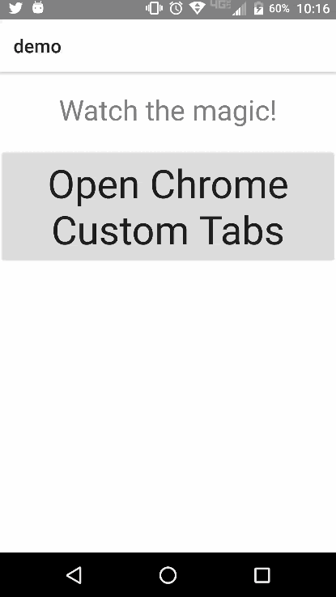
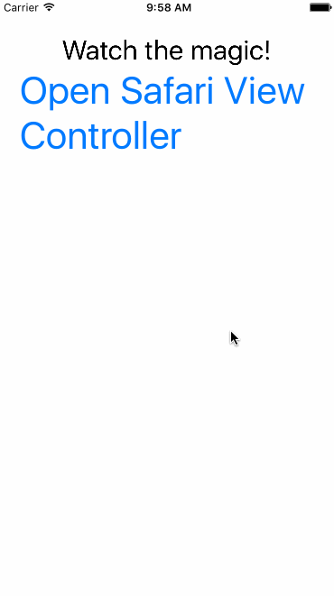

[](https://www.npmjs.com/package/nativescript-advanced-webview)
[](https://www.npmjs.com/package/nativescript-advanced-webview)

# NativeScript-Advanced-Webview
An advanced webview using [Chrome Custom Tabs](https://developer.chrome.com/multidevice/android/customtabs#whatarethey) on Android and [SFSafariViewController](https://developer.apple.com/reference/safariservices/sfsafariviewcontroller?language=objc) on iOS.

[Here is a video](https://youtu.be/LVseK_CZp5g) showing off Chrome CustomTabs in NativeScript.

### Perf Matters
[Android Comparison](https://developer.chrome.com/multidevice/images/customtab/performance.gif)

#### Android
[CustomTabs](https://developer.android.com/reference/android/support/customtabs/package-summary.html)
#### iOS
[SFSafariViewController](https://developer.apple.com/reference/safariservices/sfsafariviewcontroller?language=objc)


### Demo

Android |  iOS
-------- | ---------
 | 


## Installation
To install execute

```
tns plugin add nativescript-advanced-webview
```

## Example

#### TypeScript

```typescript
import { openAdvancedUrl, AdvancedWebViewOptions } from 'nativescript-advanced-webview';
    //// or
import * as AdvancedWebView from 'nativescript-advanced-webview'

public whateverYouLike() {
    
    let opts: AdvancedWebViewOptions = {
        url: 'https://www.youtube.com/watch?v=dQw4w9WgXcQ',
        toolbarColor: '#ff4081',
        toolbarControlsColor: '#333', // iOS only
        showTitle: false // Android only
    };
    
    openAdvancedUrl(opts);
}

```

#### Javascript

```javascript

var AdvancedWebView  = require("nativescript-advanced-webview");

exports.openChromTabs = function(args){
    //var gotoUrl = args.view.bindingContext.url;

    var opts = {
            url: args.view.bindingContext.url,
            toolbarColor: '#ff4081',
            toolbarControlsColor: '#333', // iOS only
            showTitle: false // Android only
    };
   console.log(args.view.bindingContext.url);

   AdvancedWebView.openAdvancedUrl(opts);

```

### API

- openAdvancedUrl(options: AdvancedWebViewOptions)

##### AdvancedWebViewOptions Properties
- url: string
- toolbarColor: string
- toolbarControlsColor: string - ** iOS only **
- showTitle: boolean - ** Android only **
